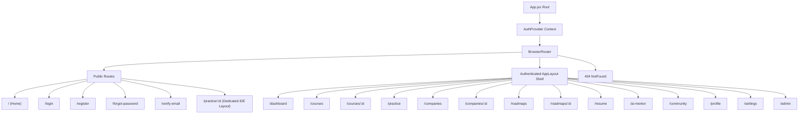
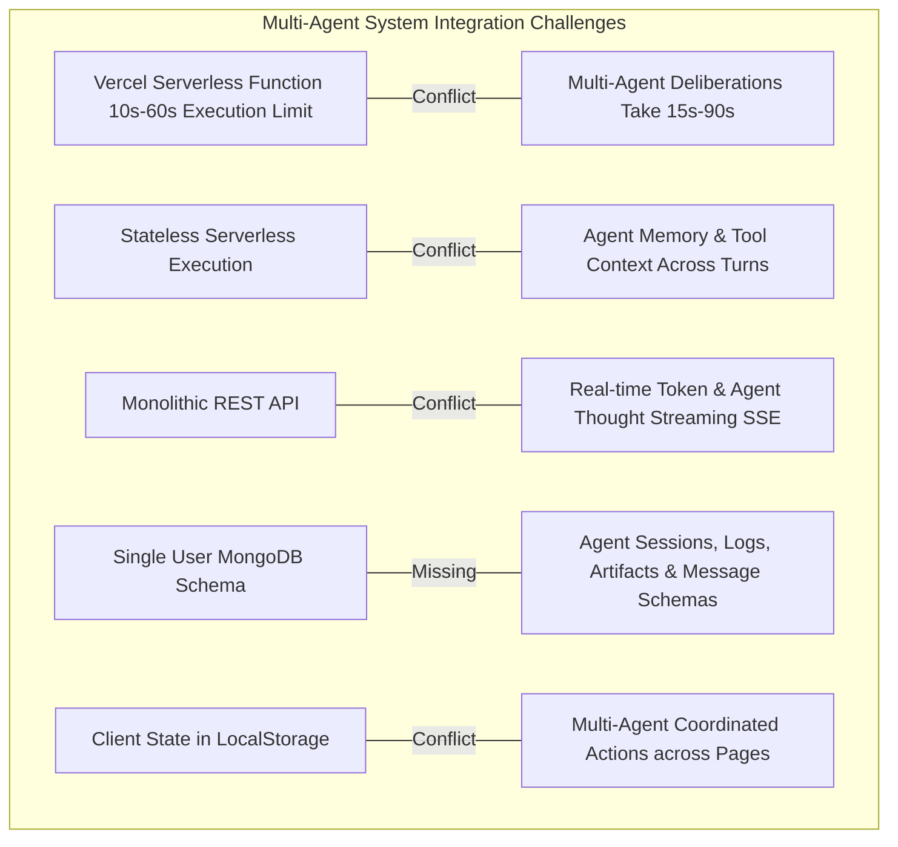
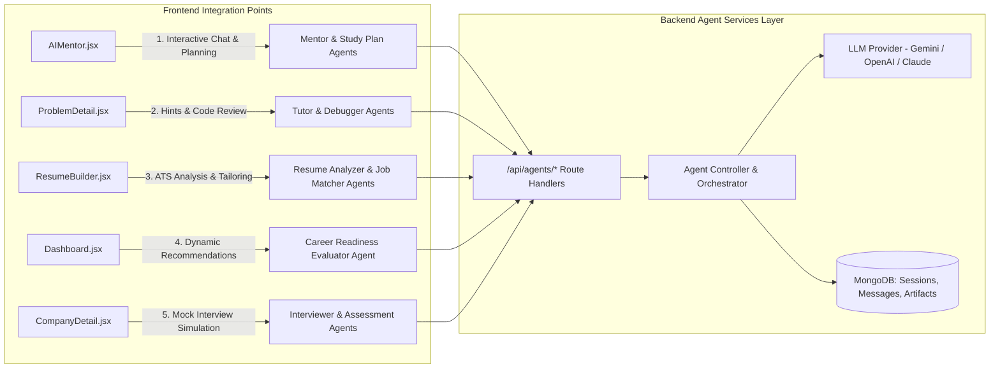

# Comprehensive Project Analysis: CareerForge (LearnHub)

> **Document Type:** System Architecture & Codebase Inspection Report  
> **Target Project:** CareerForge (LearnHub)  
> **Project Root:** `d:\Projects\LearnHub`  
> **Timestamp:** September 9, 2026  
> **Status:** Existing Production Codebase Analyzed (No modifications to existing app logic)

---

## Executive Summary

**CareerForge (LearnHub)** is a full-stack career preparation and learning platform built on the **MERN (MongoDB, Express, React, Node.js)** stack. It offers students and job seekers structured placement training across Data Structures & Algorithms (DSA), Web Development, System Design, Aptitude, AI/ML, and DevOps.

The platform provides a modern, polished user interface built with **Vite, React 18, and TailwindCSS (Deep Teal `#0F766E` and Coral `#F97360` design identity)**. The frontend features interactive dashboards, curated course curricula with embedded video lessons and Markdown notes, an in-browser code editor with Monaco Editor, learning roadmaps, company preparation modules, an ATS resume builder mockup, and a mock AI mentor.

The backend is an **Express 4.x REST API** connected to **MongoDB via Mongoose 8.x**, providing JWT-based authentication and basic user administration, configured for deployment on **Vercel** via serverless functions.

---

## 1. Frontend Framework & Tooling

| Component / Layer | Specification | Details |
|---|---|---|
| **Library** | **React 18.3.1** | Component-driven UI using functional components and React Hooks (`useState`, `useEffect`, `useRef`, `useContext`) |
| **Bundler / Build Tool** | **Vite 6.0.7** | Fast ESM dev server configured with `@vitejs/plugin-react` |
| **Styling Engine** | **TailwindCSS 3.4.19** + PostCSS 8.5.19 + Autoprefixer 10.5.3 | Extended custom palette with Deep Teal (`#0F766E`), Coral (`#F97360`), neutral Stone scales, custom shadows, and animations |
| **CSS Architecture** | Hybrid Tailwind + Vanilla CSS | `index.css` (global resets, design tokens, utility classes), `landing.css`, `auth.css`, `courses.css`, `practice.css` |
| **Routing** | **React Router DOM 7.1.1** | Client-side routing with nested layout routes (`AppLayout`), public standalone routes (`Home`, `Login`, `Register`, `ProblemDetail`), and 404 catch-all |
| **State Management** | **React Context API + Local State** | `AuthContext` provides global authentication state; feature pages maintain local state; `localStorage` stores tokens, user data, and community posts |
| **HTTP Client** | **Axios 1.7.9** | Centralized Axios instance (`client/src/services/api.js`) with request/response interceptors for Bearer token injection and 401 handling |
| **Code Editor** | **@monaco-editor/react 4.7.0** | VS Code-powered browser code editor with JetBrains Mono font, dark theme, and syntax support for JavaScript, Python, Java, C++ |
| **Motion & Animations** | **Framer Motion 12.40.0** | Page-level entry animations, expandable cards, message feed slide-ins, and animated SVGs |
| **Data Visualization** | **Recharts 3.8.1** | Interactive AreaChart (activity trends) and PieChart (problem breakdown donut) in Dashboard |
| **Media & Markdown** | **React Player 3.4.0** & **React Markdown 10.1.0** | Embedded YouTube video playback and Markdown rendering for course notes and problem descriptions |
| **Notification System** | **React Hot Toast 2.6.0** | Toaster notifications for auth feedback, code runs, and user actions |
| **Iconography** | **Lucide React 1.24.0** + **React Icons 5.6.0** | Feather, FontAwesome, and Lucide vector icons |

---

## 2. Backend Framework & Architecture

| Component / Layer | Specification | Details |
|---|---|---|
| **Runtime** | **Node.js** (>= 18.0.0, recommended LTS 20.x / 22.x) | CommonJS module system (`require` / `module.exports`) |
| **Framework** | **Express 4.21.2** | RESTful HTTP API server |
| **Database ODM** | **Mongoose 8.9.5** | Object modeling for MongoDB with schema validation and pre-save middleware |
| **Authentication** | **jsonwebtoken 9.0.2** & **bcryptjs 2.4.3** | Stateless JWT authentication (7-day expiry) and 12-round bcrypt password hashing |
| **Middleware** | `cors`, `morgan`, `express.json`, `express.urlencoded` | Cross-origin resource sharing, HTTP request logging (`dev` format), request body parsing |
| **Custom Middleware** | `auth.js` (`protect`, `authorize`), `errorHandler.js` | JWT verification, RBAC role guard (`user`, `admin`), centralized Mongoose & JWT error formatting |
| **Environment Config** | **dotenv 16.4.7** | Environment variable management via `server/.env` |
| **Dev Tooling** | **nodemon 3.1.9** | File-watching automatic restart in development |
| **Serverless Integration** | `@vercel/node` | Exports `app` for Vercel Serverless Functions with conditional port listening |

---

## 3. Current Folder Structure

```
d:\Projects\LearnHub\
├── .git/                                # Git version control repository
├── .gitignore                           # Git ignore rules (node_modules, .env, dist, etc.)
├── fix-colors.js                        # Utility script for styling refactors
├── package.json                         # Root helper package (react-player)
├── package-lock.json                    # Root package lock
├── README.md                            # High-level project documentation
├── requirements.txt                     # Full system, DB, env & prerequisite specifications
├── start.bat                            # Windows double-click launcher for client + server
├── vercel.json                          # Monorepo build and routing configuration for Vercel
├── VERCEL_DEPLOYMENT.md                 # Detailed deployment guide for Vercel + MongoDB Atlas
│
├── client/                              # Vite + React Frontend Application
│   ├── .env                             # Client environment variables (VITE_API_URL)
│   ├── .env.example                     # Example environment template
│   ├── index.html                       # HTML5 entry point with Inter/JetBrains Mono fonts
│   ├── package.json                     # Frontend dependencies & build scripts
│   ├── package-lock.json                # Frontend dependency lock
│   ├── postcss.config.js                # PostCSS configuration for Tailwind
│   ├── tailwind.config.js               # Tailwind configuration (Deep Teal & Coral theme)
│   ├── vercel.json                      # Frontend SPA routing configuration
│   ├── vite.config.js                   # Vite dev server (port 3000) & proxy to :5000
│   ├── public/                          # Static public assets
│   └── src/
│       ├── App.jsx                      # App root with Route definitions & AuthProvider
│       ├── main.jsx                     # ReactDOM root render with global CSS imports
│       ├── assets/                      # Static images and icons
│       ├── components/
│       │   ├── Navbar.jsx               # Legacy / standalone navigation component
│       │   ├── courses/                 # Course-related UI components
│       │   │   ├── CourseCard.jsx       # Grid card for courses with badges and progress
│       │   │   ├── CourseFilters.jsx    # Category and level filters
│       │   │   └── CourseRow.jsx        # Horizontal course listing row
│       │   ├── dashboard/               # Modular dashboard widgets
│       │   │   ├── DailyTasks.jsx       # Today's tasks card
│       │   │   ├── PlacementReadiness.jsx # Circular gauge for readiness
│       │   │   ├── ProblemsChart.jsx    # Recharts problem chart
│       │   │   ├── ProgressCards.jsx    # Metric overview cards
│       │   │   ├── RecentActivity.jsx   # Activity log feed
│       │   │   ├── StreakHeatmap.jsx    # 30-day activity heatmap
│       │   │   ├── WeeklyChart.jsx      # Weekly hours/problems chart
│       │   │   └── WelcomeBanner.jsx    # Greeting banner widget
│       │   ├── landing/                 # Public landing page sections
│       │   │   ├── CategoryGrid.jsx     # Course category grid
│       │   │   ├── CompanyCarousel.jsx  # Marquee company logo carousel
│       │   │   ├── Footer.jsx           # Landing page footer
│       │   │   ├── HeroSection.jsx      # Hero section with animated CTAs
│       │   │   ├── HowItWorks.jsx       # 3-step platform workflow
│       │   │   ├── LandingNav.jsx       # Landing header navbar
│       │   │   ├── StatsBar.jsx         # Metric counters banner
│       │   │   └── TestimonialSlider.jsx# Student review carousel
│       │   ├── layout/                  # Main authenticated application shell
│       │   │   ├── AppLayout.jsx        # Shell with Sidebar + TopNavbar + Outlet
│       │   │   ├── Sidebar.jsx          # Collapsible responsive sidebar
│       │   │   └── TopNavbar.jsx        # Search, notifications, AI button & user menu
│       │   ├── practice/                # Coding practice components
│       │   │   ├── CodeEditor.jsx       # Monaco code editor wrapper
│       │   │   ├── ProblemTable.jsx     # Filterable problem table
│       │   │   └── TestCasePanel.jsx    # Multi-tab test cases & output console
│       │   └── ui/                      # Reusable UI atoms and molecules
│       │       ├── Badge.jsx            # Difficulty & status pill badges
│       │       ├── GlassCard.jsx        # Glassmorphic card container
│       │       ├── LoadingSpinner.jsx   # Spinner & full-screen page loader
│       │       ├── Modal.jsx            # Animated popup dialog
│       │       ├── ProgressRing.jsx     # SVG circular progress indicator
│       │       ├── SearchBar.jsx        # Search input with icon
│       │       ├── StatCard.jsx         # KPI metric card with icon
│       │       └── Tabs.jsx             # Segmented tab switcher
│       ├── context/
│       │   └── AuthContext.jsx          # React context for auth state & methods
│       ├── data/
│       │   └── mockData.js              # Comprehensive mock data store
│       ├── hooks/
│       │   └── useForm.js               # Form management & submission hook
│       ├── pages/                       # 20 page-level components
│       │   ├── AIMentor.jsx             # AI Career Mentor chat interface
│       │   ├── Community.jsx            # Community discussion & showcase forum
│       │   ├── Companies.jsx            # Target companies catalog
│       │   ├── CompanyDetail.jsx        # Company OA questions, reviews & FAQs
│       │   ├── CourseDetail.jsx         # Full course player with curriculum tree
│       │   ├── Courses.jsx              # Course discovery catalog
│       │   ├── Dashboard.jsx            # Main authenticated learner dashboard
│       │   ├── ForgotPassword.jsx       # Password recovery interface
│       │   ├── Home.jsx                 # Public landing page
│       │   ├── Login.jsx                # User authentication sign-in
│       │   ├── NotFound.jsx             # 404 error page
│       │   ├── Practice.jsx             # DSA & system design problem catalog
│       │   ├── ProblemDetail.jsx        # LeetCode-style split IDE & problem view
│       │   ├── Profile.jsx              # User profile & target company goals
│       │   ├── Register.jsx             # Account registration page
│       │   ├── ResumeBuilder.jsx        # ATS resume creator & live preview
│       │   ├── RoadmapDetail.jsx        # Interactive milestone roadmap graph
│       │   ├── Roadmaps.jsx             # Career track roadmaps catalog
│       │   ├── Settings.jsx             # Account preferences & security
│       │   └── VerifyEmail.jsx          # 6-digit OTP verification interface
│       ├── services/
│       │   └── api.js                   # Configured Axios instance with interceptors
│       ├── styles/
│       │   ├── auth.css                 # Authentication styles
│       │   ├── courses.css              # Video player & curriculum styling
│       │   ├── index.css                # Global stylesheet & design tokens
│       │   ├── landing.css              # Landing marquee keyframes
│       │   └── practice.css             # Split-pane & markdown IDE styling
│       └── utils/
│           ├── helpers.js               # General helper functions (formatting, debounce)
│           └── userHelper.js            # Author and user fallback resolution utility
│
└── server/                              # Node.js + Express Backend Application
    ├── .env                             # Backend environment variables
    ├── .env.example                     # Example environment template
    ├── package.json                     # Backend dependencies & npm scripts
    ├── package-lock.json                # Backend dependency lock
    ├── server.js                        # Express server entry point & route registration
    ├── vercel.json                      # Vercel serverless function routing
    ├── config/
    │   └── db.js                        # Mongoose cached connection handler
    ├── controllers/
    │   ├── auth.controller.js           # Register, login, and getMe handlers
    │   └── user.controller.js           # User CRUD handlers (admin & profile)
    ├── middleware/
    │   ├── auth.js                      # JWT protect & role authorize middleware
    │   └── errorHandler.js              # Centralized error formatting middleware
    ├── models/
    │   └── User.model.js                # Mongoose User schema & password hashing
    ├── routes/
    │   ├── auth.routes.js               # /api/auth routes
    │   └── user.routes.js               # /api/users routes
    ├── utils/
    │   └── responseHelper.js            # Standardized API response formatters
    └── validators/
        └── auth.validator.js            # Request payload validator utilities
```

---

## 4. Existing React Pages

| Route | Component | Layout | Purpose & Current Functionality |
|---|---|---|---|
| `/` | `Home.jsx` | Public | High-conversion marketing landing page with hero section, platform statistics, company marquee, feature categories, 3-step workflow, student testimonials, and CTA banners. |
| `/login` | `Login.jsx` | Public | Split-screen login interface with branding banner, daily insight card, email/password form with JWT integration, and social login placeholders. |
| `/register` | `Register.jsx` | Public | Account creation interface with value proposition list, validation, and direct JWT login upon signup. |
| `/forgot-password` | `ForgotPassword.jsx` | Public | Password recovery request UI with mock email reset link notification. |
| `/verify-email` | `VerifyEmail.jsx` | Public | 6-digit OTP verification interface with auto-focus, backspace navigation, auto-submit, and redirect. |
| `/dashboard` | `Dashboard.jsx` | `AppLayout` | Learner home base featuring animated KPI stat cards, readiness score gauge, AI mentor CTA, activity area chart (week/month/year), problem breakdown donut chart, "Continue Learning" carousel, and interactive daily tasks checklist. |
| `/courses` | `Courses.jsx` | `AppLayout` | Course discovery page featuring category filters (DSA, Web Dev, System Design, Aptitude, AI/ML, DevOps), search input, featured curriculum hero slider, and course card grid. |
| `/courses/:id` | `CourseDetail.jsx` | `AppLayout` | Deep curriculum viewer with embedded `ReactPlayer` for YouTube lectures, section accordion with completion ticks, lesson type badges (video, reading, quiz, assignment), interactive quiz widget, and Markdown study notes. |
| `/practice` | `Practice.jsx` | `AppLayout` | Coding catalog with search, topic tags, multi-faceted filtering (difficulty, status, company tags like Google/Amazon), featured curriculum carousel, and problem table. |
| `/practice/:id` | `ProblemDetail.jsx` | Standalone Fullscreen | LeetCode-style dual-pane IDE with Markdown problem description, examples, constraints, Monaco code editor, multi-language selector (JS, Python, Java, C++), and test case execution panel (`TestCasePanel`). |
| `/companies` | `Companies.jsx` | `AppLayout` | Target company directory (Google, Amazon, Microsoft) displaying package ranges, typical roles, and links to interview preparation. |
| `/companies/:id` | `CompanyDetail.jsx` | `AppLayout` | Company-specific preparation hub with tabbed view for frequent Online Assessment (OA) questions, verified interview experiences, and company hiring FAQs. |
| `/roadmaps` | `Roadmaps.jsx` | `AppLayout` | Visual career path library (Java Backend Developer, MERN Stack Developer, Data Scientist) with duration, module count, and progress rings. |
| `/roadmaps/:id` | `RoadmapDetail.jsx` | `AppLayout` | Vertical alternating milestone tree with completed nodes, pending steps, and resource exploration links. |
| `/resume` | `ResumeBuilder.jsx` | `AppLayout` | Split-view resume builder with ATS match score gauge (85%), keyword recommendations ("Docker", "Kubernetes"), editable form sections (Personal Data, Experience), and live resume preview with PDF export CTA. |
| `/ai-mentor` | `AIMentor.jsx` | `AppLayout` | AI placement mentor chat interface with suggested quick prompts, bot and user message bubbles, typing indicators, and simulated contextual responses for DSA roadmaps, mock interviews, and resume critiques. |
| `/community` | `Community.jsx` | `AppLayout` | Rich community forum with category filters (Interview Experiences, Doubt Resolution, Project Showcase), post creation modal, like counters, threaded comments, and `localStorage` persistence. |
| `/profile` | `Profile.jsx` | `AppLayout` | User profile overview with avatar, target role, graduation year, preparation stat cards, and target company match progress bars. |
| `/settings` | `Settings.jsx` | `AppLayout` | User preferences covering brand color theme, email notifications toggle, public profile visibility, and password update form. |
| `/admin` | Inline JSX | `AppLayout` | Placeholder route for future administrative dashboard (`Admin Dashboard Coming Soon`). |
| `*` | `NotFound.jsx` | Public | 404 Not Found error page with redirect to home. |

---

## 5. Existing Reusable Components

### Layout Components (`client/src/components/layout/`)
- **`AppLayout.jsx`**: Main application shell. Controls sidebar collapse state, mobile drawer overlay, top navigation positioning, and renders route children via `<Outlet />`.
- **`Sidebar.jsx`**: Left navigation bar organized into three distinct groups: *Main* (Dashboard, Courses, Practice), *Placement* (Companies, Roadmaps, Resume Builder), and *Community* (AI Mentor, Community). Supports expanded (260px) and collapsed (72px) states with Framer Motion transitions and user profile footer with logout.
- **`TopNavbar.jsx`**: Sticky header with mobile menu trigger, global search bar with `⌘K` keyboard shortcut listener, quick AI Mentor button, notification bell badge, and user avatar dropdown menu.

### UI Primitives (`client/src/components/ui/`)
- **`Badge.jsx`**: Pill badge component supporting variants (`easy`, `medium`, `hard`, `default`, `solved`, `unsolved`).
- **`GlassCard.jsx`**: Glassmorphism container with backdrop blur, customizable padding, and border glow.
- **`LoadingSpinner.jsx`**: Animated spinner with optional full-screen overlay and configurable status text.
- **`Modal.jsx`**: Accessible modal overlay powered by Framer Motion with backdrop click-to-close, header, body, and footer slots.
- **`ProgressRing.jsx`**: SVG-based circular progress indicator with configurable radius, stroke width, progress percentage, and center text.
- **`SearchBar.jsx`**: Input field pre-configured with search icon, clear button, and change handler.
- **`StatCard.jsx`**: Metric display card with icon slot, label, value, trend indicator, and optional background accent.
- **`Tabs.jsx`**: Segmented tab switcher supporting pill or underline styling for section navigation.

### Practice Components (`client/src/components/practice/`)
- **`CodeEditor.jsx`**: Monaco Editor wrapper configured with `vs-dark` theme, JetBrains Mono font, line wrapping, and syntax highlighting.
- **`TestCasePanel.jsx`**: Bottom console panel for problem solving with test case tab navigation, Input / Expected Output / Actual Output display, and "Run Code" / "Submit" trigger buttons.
- **`ProblemTable.jsx`**: Data table rendering problem listings with title, difficulty badge, acceptance rate, tags, and company chips.

### Course Components (`client/src/components/courses/`)
- **`CourseCard.jsx`**: Card rendering course thumbnail, category pill, instructor, rating, student count, duration, and progress bar.
- **`CourseFilters.jsx`**: Category pill row and difficulty level dropdown.
- **`CourseRow.jsx`**: Compact horizontal list item representation for course collections.

### Dashboard Components (`client/src/components/dashboard/`)
- **`WelcomeBanner.jsx`**, **`ProgressCards.jsx`**, **`PlacementReadiness.jsx`**, **`WeeklyChart.jsx`**, **`ProblemsChart.jsx`**, **`DailyTasks.jsx`**, **`StreakHeatmap.jsx`**, **`RecentActivity.jsx`**: Modular widgets designed for dashboard composition.

### Landing Page Components (`client/src/components/landing/`)
- **`LandingNav.jsx`**, **`HeroSection.jsx`**, **`StatsBar.jsx`**, **`CompanyCarousel.jsx`**, **`CategoryGrid.jsx`**, **`HowItWorks.jsx`**, **`TestimonialSlider.jsx`**, **`Footer.jsx`**: Specialized components for the public marketing site.

---

## 6. Routing & Navigation Architecture

Routing is managed via **`react-router-dom` v7.1.1** inside [client/src/App.jsx](file:///d:/Projects/LearnHub/client/src/App.jsx):



### Route Protection Analysis
- The `<AppLayout />` component currently houses the authenticated dashboard and feature pages.
- Currently, route guarding operates via Axios interceptor (redirecting on HTTP 401) and in-memory state; a dedicated client-side `<ProtectedRoute>` wrapper that redirects unauthenticated users immediately to `/login` before rendering children is not yet implemented.

---

## 7. Authentication & Authorization

### Backend Implementation
- **Registration (`POST /api/auth/register`)**:
  - Validates `name`, `email`, and `password`.
  - Verifies email uniqueness in MongoDB.
  - Hashes password using `bcryptjs` with salt work factor of 12.
  - Returns signed JWT and sanitized user object `{ id, name, email, role }`.
- **Login (`POST /api/auth/login`)**:
  - Validates credentials against `User` collection with `.select('+password')`.
  - Compares password via `user.comparePassword(password)`.
  - Returns signed JWT and sanitized user object.
- **Token Verification (`GET /api/auth/me`)**:
  - Protected by `protect` middleware.
  - Verifies token using `JWT_SECRET`.
  - Queries `User.findById(decoded.id)` and returns fresh user record.
- **Role-Based Access Control (`authorize(...roles)`)**:
  - Middleware checks `req.user.role`.
  - Protects admin endpoints (e.g., `GET /api/users`, `DELETE /api/users/:id`).

### Frontend Implementation
- Managed by `client/src/context/AuthContext.jsx`:
  - Initializes user state from `localStorage.getItem('user')`.
  - On mount, if `localStorage.getItem('token')` exists, verifies validity via `GET /api/auth/me`.
  - Exposes `user`, `loading`, `login(email, password)`, `register(name, email, password)`, `logout()`, `updateUser(data)`.
  - `client/src/services/api.js` automatically attaches `Authorization: Bearer <token>` to all requests.
  - Intercepts 401 responses, removes token, and redirects to `/login`.

---

## 8. Existing API Endpoints

All backend endpoints are registered in `server/server.js` under `/api`:

| Method | Endpoint | Protection | Controller Handler | Purpose |
|---|---|---|---|---|
| `POST` | `/api/auth/register` | Public | `auth.controller.register` | Register a new user with name, email, password |
| `POST` | `/api/auth/login` | Public | `auth.controller.login` | Authenticate user credentials and return JWT |
| `GET` | `/api/auth/me` | Bearer Token | `auth.controller.getMe` | Retrieve currently authenticated user profile |
| `GET` | `/api/users` | Admin Role | `user.controller.getUsers` | List all registered users (admin only) |
| `GET` | `/api/users/:id` | Bearer Token | `user.controller.getUserById` | Fetch single user profile by MongoDB ObjectId |
| `PUT` | `/api/users/:id` | Bearer Token | `user.controller.updateUser` | Update user details by ID |
| `DELETE`| `/api/users/:id` | Admin Role | `user.controller.deleteUser` | Delete user record by ID (admin only) |
| `GET` | `/api/health` | Public | Inline handler | Health check returning status and server ISO timestamp |

---

## 9. Existing MongoDB Models & Schemas

Currently, only one Mongoose model exists in the backend: `server/models/User.model.js`.

```javascript
// User Schema Structure
{
  name: {
    type: String,
    required: [true, 'Name is required'],
    trim: true,
  },
  email: {
    type: String,
    required: [true, 'Email is required'],
    unique: true,
    lowercase: true,
    trim: true,
  },
  password: {
    type: String,
    required: [true, 'Password is required'],
    minlength: 6,
    select: false, // Omitted from queries by default
  },
  role: {
    type: String,
    enum: ['user', 'admin'],
    default: 'user',
  },
  createdAt: Date, // via timestamps: true
  updatedAt: Date  // via timestamps: true
}
```

### Schema Hooks & Methods:
- `userSchema.pre('save')`: Hashes `password` using `bcrypt.hash(..., 12)` if modified.
- `userSchema.methods.comparePassword(candidatePassword)`: Executes `bcrypt.compare(candidatePassword, this.password)`.

---

## 10. Existing Database Connection

Defined in [server/config/db.js](file:///d:/Projects/LearnHub/server/config/db.js):
- **Serverless Optimization**: Implements connection caching across invocations via `global.mongoose = { conn: null, promise: null }`.
- **Options**: Sets `bufferCommands: false` to prevent buffering timeouts in serverless execution environments.
- **Fail-safe**: In non-Vercel environments (`!process.env.VERCEL`), an unhandled connection error triggers `process.exit(1)`. On Vercel, it rethrows to prevent process termination in the serverless worker.

---

## 11. Existing Environment Variables

### Backend Configuration (`server/.env`)
| Variable | Development Default | Description |
|---|---|---|
| `PORT` | `5000` | Port for local Express server |
| `MONGO_URI` | `mongodb://localhost:27017/learnhub` | Connection string for MongoDB (Local or Atlas URI) |
| `JWT_SECRET` | `your_jwt_secret_here` | Secret key used to sign and verify JWT authentication tokens |
| `JWT_EXPIRES_IN` | `7d` | Token validity timeframe |
| `NODE_ENV` | `development` | Server runtime environment (`development` / `production`) |
| `VERCEL` | Undefined locally | Set automatically by Vercel to indicate serverless runtime |

### Frontend Configuration (`client/.env`)
| Variable | Development Default | Description |
|---|---|---|
| `VITE_API_URL` | `http://localhost:5000/api` | Base URL used by Axios in `client/src/services/api.js` |

*Note: In Vite development, requests to `/api` are also proxied to `http://localhost:5000` via `client/vite.config.js`.*

---

## 12. Existing Dashboard Analysis

The learner dashboard ([client/src/pages/Dashboard.jsx](file:///d:/Projects/LearnHub/client/src/pages/Dashboard.jsx)) is a fully styled analytics hub:

1. **User Welcome**: Greets the authenticated user with animated waving emoji and custom subtitle.
2. **Career Readiness Score**:
   - Dynamic animated circular progress indicator with ease-out interpolation.
   - Computes readiness index: `(dsaProgress + resumeScore + (mockScore * 10)) / 3`.
   - Displays user streak count (12 days) and global rank (`#12,450`).
3. **AI Mentor Promotional Card**:
   - Styled with Deep Teal gradient, background watermark bot illustration, and direct CTA to `/ai-mentor`.
4. **Metric Stat Cards**:
   - 4 animated KPI cards featuring count-up number animation:
     - DSA Mastery (`45%`)
     - Course Progress (`60%`)
     - Mock Interview (`80%`)
     - ATS Resume (`85%`)
5. **Activity Analytics**:
   - Recharts `AreaChart` tracking problems solved vs hours studied.
   - Dynamic tab switching between Weekly, Monthly, and Yearly mock datasets.
   - Custom styled tooltip component.
6. **Problem Breakdown**:
   - Recharts `PieChart` (donut chart) breaking down solved problems into Easy (`45`), Medium (`20`), and Hard (`5`).
7. **Continue Learning Carousel**:
   - Horizontal scrolling carousel displaying enrolled courses with progress bars and "Resume Module" triggers.
8. **Today's Tasks**:
   - Interactive daily checklist (e.g., "Solve 2 DSA Questions", "Complete React Context Lecture").
   - Clicking toggles completion state in React state and dynamically recalculates percentage and XP reward.
9. **Data Source**: Current metrics and graphs consume static structures from `client/src/data/mockData.js`.

---

## 13. Existing Learning Features

### Course Discovery (`client/src/pages/Courses.jsx`)
- 6 primary tracks: Data Structures & Algorithms, Web Development, System Design, Aptitude & Reasoning, AI & Machine Learning, DevOps & Cloud.
- Filter pills and search bar with live filtering.
- Featured courses hero carousel with high-resolution imagery.

### Course Player & Curriculum (`client/src/pages/CourseDetail.jsx`)
- Multi-section curriculum tree embedded directly in the frontend:
  - **DSA Track**: Introduction, Arrays & Strings, Linked Lists, Stacks & Queues, Trees & Graphs.
  - **Web Dev Track**: Frontend Fundamentals, React Deep Dive, Backend with Node/Express, Full-Stack Integration.
  - **System Design Track**: High-Level Architecture, Databases & Caching, Message Queues & Microservices.
  - **Aptitude, AI/ML, and DevOps Tracks**: Dedicated curriculum sections.
- Embedded video player using `react-player` referencing curated educational YouTube videos (Striver, Kunal Kushwaha, Gaurav Sen, Andrew Ng, freeCodeCamp, etc.).
- Markdown lecture notes rendered via `react-markdown`.
- Interactive knowledge check quizzes (`QuizWidget`) with instant answer validation.
- Direct links from assignment lessons to interactive coding IDE (`/practice/:problemId`).
- Lesson completion toggling with progress percentage recalculation.

### Learning Roadmaps (`client/src/pages/Roadmaps.jsx` & `RoadmapDetail.jsx`)
- High-level roadmaps for Java Backend, MERN Stack, and Data Science.
- Step-by-step visual roadmap showing completed milestones (Internet Fundamentals, HTML/CSS) and upcoming nodes (JavaScript, React, Node.js).

---

## 14. Existing Assessment Features

### Coding Practice Catalog (`client/src/pages/Practice.jsx`)
- Problem listing with acceptance rates, difficulty badges, tags, and targeted company tags.
- Multi-criteria filtering: Search query, category tabs (Array, String, Dynamic Programming, Math), difficulty dropdown, status dropdown, company filter.

### Interactive Coding IDE (`client/src/pages/ProblemDetail.jsx`)
- **Split-Pane Architecture**: Left pane for problem description and constraints; right pane for editor and console.
- **Monaco Editor Integration**: Embedded VS Code editor supporting syntax highlighting for JavaScript, Python, Java, and C++.
- **Test Case Runner (`TestCasePanel.jsx`)**:
  - Multi-tab test case selector (Case 1, Case 2, Case 3).
  - Displays input parameters, expected output, and execution status.
  - "Run Code" and "Submit" triggers with simulated latency, judging toasts, and pass/fail indicators.

### Company Interview Preparation (`client/src/pages/Companies.jsx` & `CompanyDetail.jsx`)
- Dedicated modules for top tech firms: Google, Amazon, Microsoft.
- Online Assessment (OA) question lists.
- Candidate interview experiences and interview round breakdowns.
- Company-specific recruitment FAQs.

---

## 15. Existing Progress Tracking

- **Dashboard**: Aggregates DSA progress, course completion, mock interview score, ATS resume score, daily streak, and global leaderboard rank.
- **CourseDetail**: Tracks completed lessons against total lesson count and updates a real-time progress bar.
- **Heatmap (`StreakHeatmap.jsx`)**: Visual 30-day commit-style activity grid with variable opacity levels reflecting study intensity.
- **Profile (`Profile.jsx`)**: Visual progress indicators for Amazon match (`78%`), Google match (`65%`), and ATS resume readiness (`85%`).
- **Data Persistence Reality**:
  - All progress metrics on Dashboard, Courses, Practice, and Profile currently run on **in-memory React state** or **static mock data** (`MOCK_DATA`).
  - Progress resets when the browser is refreshed because there are no backend MongoDB endpoints or schemas currently persisting user course progress or code submissions.

---

## 16. Existing AI Functionality

### AI Career Mentor (`client/src/pages/AIMentor.jsx`)
- **UI Design**: Modern conversational interface with Deep Teal branding, bot avatar, user message bubbles, and smooth auto-scrolling.
- **Current Logic**: Simulated client-side chatbot running via `setTimeout(..., 1200)`.
- **Predefined Scenarios**:
  - Query containing "dp" or "dynamic" returns a curated 3-day Dynamic Programming roadmap.
  - Query containing "mock" or "interview" initiates a simulated 15-minute coding interview prompt.
  - Query containing "resume" provides Google X-Y-Z formula bullet-point feedback.
  - Default fallback recommends focus areas based on recent activity.
- **Suggested Quick Prompts**: "Generate DP Study Plan", "Conduct Mock Interview", "Review my Resume".
- **Backend Connection**: Currently **0 backend AI endpoints exist**. There is no integration with OpenAI, Google Gemini, Anthropic Claude, or LangChain.

### Resume Builder ATS Evaluator (`client/src/pages/ResumeBuilder.jsx`)
- Displays an ATS Match Score gauge (`85%`).
- Shows static keyword enhancement recommendations (e.g., "Add Docker and Kubernetes").
- Live dual-pane layout rendering an ATS-standard single-column resume with PDF export CTA.

---

## 17. Existing Deployment Configuration

The repository is pre-configured for deployment on **Vercel**:

### Configuration Files
1. **Root `vercel.json`**:
   ```json
   {
     "version": 2,
     "builds": [
       { "src": "client/package.json", "use": "@vercel/static-build", "config": { "distDir": "dist" } },
       { "src": "server/server.js", "use": "@vercel/node" }
     ],
     "routes": [
       { "src": "/api/(.*)", "dest": "server/server.js" },
       { "handle": "filesystem" },
       { "src": "/(.*)", "dest": "client/$1" },
       { "src": "/(.*)", "dest": "client/index.html" }
     ]
   }
   ```
2. **`server/vercel.json`**: Configures serverless Node.js execution mapping all sub-routes to `server.js`.
3. **`client/vercel.json`**: Configures single-page application client routing rewrites.
4. **Database Adaptations**: `server/config/db.js` uses connection caching to prevent connection exhaustion in serverless function lifecycles.
5. **Local Runner**: `start.bat` launches both backend (`cmd /k "cd server && npm run dev"`) and frontend (`cmd /k "cd client && npm run dev"`) in concurrent command windows.

---

## 18. Missing Features (Gap Analysis)

Before expanding or integrating multi-agent AI, the following architectural gaps exist between the current frontend capabilities and backend data persistence:

1. **Course Progress Persistence**:
   - Frontend calculates course completion in `CourseDetail.jsx`, but no `Enrollment` or `CourseProgress` MongoDB model exists to save user progress across sessions.
2. **Problem Submission Persistence**:
   - `ProblemDetail.jsx` has an interactive Monaco editor, but user code, test case outcomes, and submission histories are not recorded in the database.
3. **Real Code Execution Engine**:
   - Code runs are currently simulated on the frontend with timeouts. There is no sandboxed execution environment (e.g., Judge0, Piston, or isolated Docker container) to execute arbitrary user code in JS/Python/Java/C++.
4. **AI Backend Services**:
   - `AIMentor.jsx` and `ResumeBuilder.jsx` have no backend endpoints connecting to an LLM provider or multi-agent orchestrator.
5. **Community Backend & Database Persistence**:
   - Posts, comments, and likes in `Community.jsx` are currently stored in browser `localStorage` rather than MongoDB.
6. **Route Guarding**:
   - Unauthenticated users can directly access `/dashboard` or `/courses` on initial load before any API request fails. A frontend `<ProtectedRoute>` component is needed.
7. **User Profile Persistence**:
   - Profile settings, targets, and skills are not stored in the `User` schema beyond `name`, `email`, `password`, and `role`.

---

## 19. Conflicts & Technical Considerations for Multi-Agent AI

When integrating a **Multi-Agent AI System** into this existing application, the following specific conflicts and constraints must be planned for:



### 1. Serverless Execution Timeouts (Vercel)
- **Problem**: Multi-agent workflows (e.g., Planner Agent + Code Evaluator Agent + Mentor Agent communicating in a chain) often take 15 to 60+ seconds to converge. Vercel Hobby tier serverless functions terminate at **10 seconds** (Pro tier at **60 seconds**).
- **Impact**: Synchronous REST requests (`POST /api/agents/chat`) will throw `504 Gateway Timeout` errors on Vercel.
- **Solution Strategy**: Implement asynchronous job execution with polling, or use streaming responses (Server-Sent Events / SSE) with chunked transfer encoding so Vercel keeps the connection open.

### 2. Lack of Streaming Infrastructure (SSE / WebSockets)
- **Problem**: The current Express setup uses standard JSON responses (`res.json()`). Users waiting for multi-agent chains will experience high latency and perceived unresponsiveness.
- **Solution Strategy**: Add Server-Sent Events (SSE) endpoints (e.g. `res.setHeader('Content-Type', 'text/event-stream')`) so the frontend can stream agent thoughts, tool calls, and partial responses in real-time.

### 3. Agent Session & Memory Schemas Missing
- **Problem**: Multi-agent systems require persisting conversation history, agent roles, tool call traces, and state checkpoints. The database currently only has `User.model.js`.
- **Solution Strategy**: Design dedicated MongoDB schemas for `AgentSession`, `AgentMessage`, and `AgentArtifact` linked to the user's `ObjectId`.

### 4. Rate Limiting & Token Cost Management
- **Problem**: Autonomous multi-agent loops can trigger runaway LLM API calls, exhausting token quotas.
- **Solution Strategy**: Add strict iteration caps (e.g., maximum 5 agent handoffs per request), backend rate-limiting middleware, and token usage tracking in database sessions.

### 5. Non-Disruptive UI Integration
- **Problem**: Changing existing pages or layout might break the current user flow and visual polish.
- **Solution Strategy**: Keep the existing `AIMentor.jsx`, `ProblemDetail.jsx`, and `ResumeBuilder.jsx` UI layouts intact; only replace the mock handlers (`setTimeout`) with real backend API/SSE hooks.

---

## 20. Recommended Integration Points for Multi-Agent AI

To maintain complete backward compatibility without breaking existing features or altering UI aesthetics, multi-agent AI can be integrated cleanly at five natural touchpoints:



### Integration Point 1: AI Placement Mentor (`/ai-mentor`)
- **Current State**: `AIMentor.jsx` uses local mock responses.
- **Recommended Agent Integration**:
  - **Supervisor / Orchestrator Agent**: Routes user intent to specialized sub-agents.
  - **DSA Mentor Agent**: Explains algorithmic concepts, suggests optimal time/space complexity, and recommends problems from the database.
  - **Study Plan Agent**: Generates structured, day-by-day learning schedules tailored to the user's weak areas.
- **Connection**: Wire `handleSend` in `AIMentor.jsx` to an SSE stream endpoint `POST /api/agents/mentor/chat`.

### Integration Point 2: In-IDE Code Assistance & Hint Generator (`/practice/:id`)
- **Current State**: `ProblemDetail.jsx` has a Monaco editor and static test case runs.
- **Recommended Agent Integration**:
  - **Code Reviewer Agent**: Analyzes code in Monaco editor for edge cases, clean code principles, and time complexity without giving away the full answer.
  - **Hint Provider Agent**: Provides progressive hints (Socratic questioning) when test cases fail.
- **Connection**: Add an "Ask AI Assistant" drawer or floating assistant button in `ProblemDetail.jsx` passing current problem title, user code, and active test results.

### Integration Point 3: Intelligent Resume ATS Analyzer (`/resume`)
- **Current State**: `ResumeBuilder.jsx` displays a static 85% score and hardcoded keyword suggestions.
- **Recommended Agent Integration**:
  - **ATS Scorer Agent**: Evaluates user resume text against target company job descriptions.
  - **Bullet Point Optimizer Agent**: Rewrites experience bullet points to match the Google X-Y-Z formula.
- **Connection**: Add an "Analyze with AI" trigger button that submits resume form state to `POST /api/agents/resume/evaluate`.

### Integration Point 4: Dynamic Dashboard Recommendations (`/dashboard`)
- **Current State**: "Career Readiness" score and "Today's Tasks" are static.
- **Recommended Agent Integration**:
  - **Readiness Assessor Agent**: Periodically evaluates completed problems, course modules, and mock scores to produce an authentic readiness score and daily custom tasks.
- **Connection**: Add a background endpoint `GET /api/agents/readiness` called during dashboard load.

### Integration Point 5: Company Mock Interviewer (`/companies/:id`)
- **Current State**: `CompanyDetail.jsx` displays static FAQs and past experiences.
- **Recommended Agent Integration**:
  - **Interviewer Agent**: Simulates realistic technical and behavioral interview questions tailored to the specific company's hiring rubric (e.g. Google Leadership Principles or Amazon 16 Leadership Principles).
- **Connection**: Add a "Start Mock Interview for [Company]" button in `CompanyDetail.jsx` that links to a tailored AI Mentor session.

---

## 21. Summary & Next Steps

1. **The application foundation is clean, robust, and well-organized.**
2. **Frontend UI styling is unified** around the modern Deep Teal (`#0F766E`) and Coral (`#F97360`) design system with TailwindCSS.
3. **The codebase must be preserved**: existing routes, pages, styling tokens, authentication flows, and database connections must remain completely intact.
4. **Backend readiness**: Adding multi-agent AI will require:
   - Creating new non-breaking routes under `server/routes/agent.routes.js`
   - Creating dedicated MongoDB schemas for agent sessions and histories
   - Supporting streaming (SSE) to prevent Vercel serverless timeouts
   - Connecting the frontend pages (`AIMentor`, `ProblemDetail`, `ResumeBuilder`) to the real agent backend APIs without disrupting their existing aesthetic layout.
